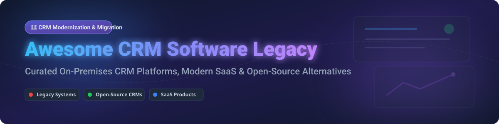

  

# 🚀 Awesome CRM Software Legacy 🏛️

  
  
  
  
  

---

> 🎯 **Curated Directory of Legacy CRM Platforms, Modern Cloud SaaS Solutions & Open-Source CRM Alternatives**  
> 💡 *Focused on On-Premises CRM Systems, Enterprise Sales Force Automation (SFA), Customer Data Migration & Open-Source Modernization Paths.*

**Last updated: October 2026**

---

## 💡 Overview & SEO Context

This repository tracks notable **legacy CRM platforms**, **modern cloud SaaS products**, and **open-source CRM alternatives** for enterprise architects, IT administrators, and SMB owners. Whether you are maintaining legacy installations (like Siebel or Dynamics CRM 2016), evaluating SaaS cloud providers (Salesforce, HubSpot, Zoho), or migrating to cost-effective open-source platforms (EspoCRM, SuiteCRM, Odoo, Twenty), this guide provides clear, data-driven comparisons.

---

## 📖 Table of Contents

- [🏛️ Legacy On-Premises CRM Platforms](#️-legacy-on-premises-crm-platforms)
- [☁️ Modern SaaS CRM Products](#️-modern-saas-crm-products)
- [🔓 Open-Source CRM Alternatives](#-open-source-crm-alternatives)
- [🤝 How to Contribute](#-how-to-contribute)
- [⚠️ Disclaimer](#️-disclaimer)
- [💖 Support & Sponsorship](#-support--sponsorship)
- [📊 Star History](#-star-history)

---

## 🏛️ Legacy On-Premises CRM Platforms

> **📊 Market Context**: The legacy on-premises CRM market is **declining but persistent**. In Japan, the on-premises CRM market was forecast to shrink from **¥440 billion (2019) to ¥365 billion (2025)**, and cloud surpassed on-premises share for the first time around **2022**. Constellation Research estimates that **on-premises CRM represents less than 20% of the global CRM market** in 2026. **Why legacy persists**: Late-majority enterprises remain satisfied with existing workflows and resist migration costs — the decline is slower than earlier predictions suggested.

| Platform | Description | Current Status | Migration Path | Company Revenue / Size |
|---|---|---|---|---|
| **[Microsoft Dynamics CRM (Legacy)](https://www.microsoft.com/en-us/dynamics-365)** | Microsoft's on-premises CRM line from Dynamics CRM 4.0 through 2016. Includes Sales, Service, and Marketing modules. | **End of support**: CRM 4.0 mainstream ended **2013**, extended **2018**; CRM 2011 mainstream ended **2016**, extended **2021**. | **Migrate to Dynamics 365** (cloud) or evaluate open-source alternatives. | **~$281B revenue** (Microsoft FY2025) |
| **[Oracle Siebel CRM](https://www.oracle.com/applications/siebel-crm/)** | **Enterprise-grade CRM with deep customization.** Used heavily in telecommunications, financial services, and public sector. **Still actively developed** — Release 26.5 (June 2026). | **Active**: Release 26.5 (June 2026) with REST API for Product Configurator and Customer 360 Agent Dashboard. | **Continue Siebel investment** or migrate to Oracle Fusion Cloud CX. | **~$53B revenue** (Oracle FY2025) |
| **[PeopleSoft CRM](https://www.oracle.com/peoplesoft/)** | **Enterprise CRM within PeopleSoft suite.** Service, sales, marketing, help desk. | **Maintenance mode** under Oracle. Supported but not actively enhanced. | **Migrate to Oracle Fusion Cloud CX** or open-source alternative. | **~$53B revenue** (Oracle FY2025) |
| **[Sage SalesLogix](https://www.sage.com/)** | **Mid-market CRM with on-premises and cloud options.** Sales, marketing, and customer service. | **Legacy**: Sage shifted focus to Sage CRM Cloud. | **Migrate to Sage CRM Cloud** or open-source alternative. | **~$2.5B revenue** (Sage FY2025 est.) |
| **[ACT!](https://www.act.com/)** | **SMB contact and sales management CRM.** Popular for offline access and Google integration. | **Active**: ACT! v20.1 with next-gen Outlook integration. | **Upgrade to ACT! Premium** (subscription) or migrate to cloud CRM. | **Part of Swiftpage** (Private SMB) |
| **[GoldMine](https://www.goldmine.com/)** | **Long-running SMB CRM with on-premises focus.** Contact management and sales automation. | **Active**: GoldMine 2026.2 released July 2026. | **Upgrade to latest GoldMine** or migrate to modern cloud CRM. | **Part of Ivanti** (~$1B revenue est.) |
| **[Pivotal CRM](https://www.aptean.com/)** | **Highly customizable enterprise CRM.** Acquired by Aptean (2015). | **Maintenance mode** under Aptean. | **Migrate to Aptean CRM** or open-source alternative. | **Part of Aptean** (~$500M revenue est.) |
| **[Onyx CRM](https://www.onyx.com/)** | **Mid-market CRM with Microsoft-centric architecture.** Acquired by CDC Software, later M2M Holdings. | **Discontinued** — no active development. | **Migrate to modern CRM** (open-source or cloud). | **N/A (Discontinued)** |
| **[Clarify CRM](https://www.nortel.com/)** | **Enterprise CRM for telecommunications and call centers.** Acquired by Nortel, then Amdocs. | **Discontinued** — legacy Amdocs CRM. | **Migrate to Amdocs CRM** or modern alternative. | **N/A (Discontinued)** |
| **[Vantive](https://www.peoplesoft.com/)** | **Customer service and support CRM.** Acquired by PeopleSoft, then Oracle. | **Discontinued** — merged into Oracle CRM. | **Migrate to Oracle CRM** or open-source. | **N/A (Discontinued)** |

---

## ☁️ Modern SaaS CRM Products

> 📈 **Market Size & Structure**: The global CRM software market is estimated at **~$88 Billion in 2026** and projected to grow at **~12.5% CAGR**. The SaaS CRM market is **moderately fragmented**: Salesforce leads with ~22% market share, followed by Microsoft, Oracle, SAP, Adobe, and HubSpot. While enterprise CRM exhibits strong platform consolidation ("winner takes most"), mid-market and SMB segments remain highly dynamic with room for specialized SaaS players.

*Sorted by Company Revenue / Valuation (Descending).*

| Product | Description | Starting Tier Price | Free Tier / Free Trial Limit | Company Revenue / Valuation |
|---|---|---|---|---|
| **[Microsoft Dynamics 365 Sales](https://dynamics.microsoft.com/)** | **Enterprise cloud SFA & CRM.** AI-driven insights with Copilot, deep Office 365 integration, and custom business workflow engine. | **$65/user/month** (Sales Professional plan) | **30-day free trial** (Full access, up to 25 users) | **~$281B revenue** (Microsoft FY2025) |
| **[Salesforce Sales Cloud](https://www.salesforce.com/)** | **Market-leading enterprise cloud CRM.** Complete sales automation, AI forecasting (Einstein), and massive app marketplace (AppExchange). | **$25/user/month** (Starter Suite plan, billed annually) | **30-day free trial** (Includes sample data & guided tour) | **~$38.8B revenue** (Salesforce FY2025) |
| **[Oracle Fusion Cloud CX](https://www.oracle.com/cx/)** | **Complete enterprise customer experience suite.** Connects data across sales, service, marketing, and commerce on Oracle Cloud Infrastructure. | **$65/user/month** (Professional Edition) | **30-day free trial** ($300 free cloud credits + guided trial) | **~$53B revenue** (Oracle FY2025) |
| **[SAP Sales Cloud](https://www.sap.com/products/crm.html)** | **Enterprise CRM built for complex B2B sales cycles.** Seamless integration into SAP S/4HANA ERP and supply chain networks. | **$58/user/month** (Standard Edition) | **30-day free trial** (Pre-configured SAP Cloud environment) | **~$36B revenue** (SAP FY2025) |
| **[Adobe Experience Cloud](https://business.adobe.com/)** | **Customer data platform & enterprise marketing automation.** Tailored for customer journey analytics and B2B lead management (Marketo). | **$1,250/month** (Marketo Engage entry tier) | **Interactive demo** (No permanent free tier; 7-day sandbox on request) | **~$21.5B revenue** (Adobe FY2025) |
| **[HubSpot CRM](https://www.hubspot.com/)** | **Inbound marketing & sales CRM platform.** Easy-to-use CRM with deal pipelines, live chat, and email tracking. | **$15/license/month** (Sales Hub Starter, billed annually) | **100% Free Plan** (Up to 1,000,000 contacts, unlimited users, basic features) | **~$2.6B revenue** (HubSpot FY2025) |
| **[Freshsales (Freshworks)](https://www.freshworks.com/crm/sales/)** | **AI-powered SMB & mid-market sales CRM.** Features Freddy AI insights, built-in phone, email campaigns, and deal scoring. | **$9/user/month** (Growth plan, billed annually) | **Free Plan** (Up to 3 users, contact management, built-in phone) | **~$720M revenue** (Freshworks FY2025) |
| **[Zoho CRM](https://www.zoho.com/crm/)** | **Comprehensive, affordable SMB & enterprise CRM.** Multi-channel communication, Zia AI assistant, and canvas customization. | **$14/user/month** (Standard plan, billed annually) | **Free Forever Plan** (Up to 3 users, leads, contacts, deals, mobile app) | **~$1.4B revenue** (Zoho Corp FY2025 est.) |
| **[Pipedrive](https://www.pipedrive.com/)** | **Sales-focused CRM built for pipeline management.** Visual deal pipelines, activity scheduling, and sales automation. | **$14/user/month** (Essential plan, billed annually) | **14-day free trial** (No credit card required, full feature access) | **~$150M revenue** (Private enterprise / Vista Equity) |
| **[Insightly](https://www.insightly.com/)** | **CRM with integrated project management.** Designed for SMBs needing transaction tracking alongside project delivery. | **$29/user/month** (Plus plan, billed annually) | **Free Plan** (Up to 2 users, 2,500 records, basic project tracking) | **~$50M revenue** (Private enterprise) |

---

## 🔓 Open-Source CRM Alternatives

*Sorted by Stars_Count (descending). Stars_Badge links directly to each repository's stargazers page.*

| Repo | Description | GitHub_Stars |
|---|---|---|
| **[Odoo](https://github.com/odoo/odoo)** | **Comprehensive open-source ERP with integrated CRM module.** Covers sales, marketing, inventory, accounting, HR, and more. **LGPLv3 licensed**. |  |
| **[Twenty](https://github.com/twentyhq/twenty)** | **Modern open-source CRM alternative to Salesforce.** Built with React, GraphQL, and TypeScript. Modern UI with full data control. **Apache 2.0 licensed**. |  |
| **[ERPNext](https://github.com/frappe/erpnext)** | **Full-featured open-source ERP & CRM built on Frappe Framework.** Includes lead management, opportunity tracking, and quotation generation. **GPLv3 licensed**. |  |
| **[Dolibarr](https://github.com/Dolibarr/dolibarr)** | **Open-source ERP & CRM for SMBs and freelancers.** Modules for customer tracking, invoicing, orders, inventory, and foundation management. **GPLv3 licensed**. |  |
| **[SuiteCRM](https://github.com/salesagility/SuiteCRM)** | **Leading enterprise open-source CRM, successor to SugarCRM CE.** Feature-rich workflow automation, reporting, and plugin ecosystem. **AGPLv3 licensed**. |  |
| **[CiviCRM](https://github.com/civicrm/civicrm-core)** | **Open-source CRM built specifically for nonprofits, NGOs, and advocacy groups.** Member tracking, contribution management, and events. **AGPLv3 licensed**. |  |
| **[EspoCRM](https://github.com/espocrm/espocrm)** | **Fast, lightweight, browser-based CRM with responsive UI.** Multiple sales pipelines, cascading links, record locking, and API integration. **AGPLv3 licensed**. |  |
| **[Vtiger CRM](https://github.com/vtiger-crm/vtigercrm)** | **Established open-source CRM platform.** Complete sales, marketing, and customer support ticket automation modules. **VPL 1.1 (MPL-based) licensed**. |  |
| **[OroCRM](https://github.com/oroinc/crm)** | **Flexible open-source CRM built on Symfony PHP framework.** Strong e-commerce integration (Magento/OroCommerce), B2B/B2C analytics. **OSL-3.0 licensed**. |  |
| **[1CRM](https://github.com/1CRM/1CRM)** | **Modular CRM with project management, contracts, and invoicing.** Flexible self-hosted deployment options. **GPLv3 / Commercial licensed**. |  |

---

## 🤝 How to Contribute

Contributions are welcome! Follow these steps to submit new legacy software or open-source CRM solutions:

1. **Fork** this repository.
2. Create a new topic branch (`git checkout -b add-new-crm-tool`).
3. Add entries to `README.md` following the exact table structure.
4. Ensure descriptions are factual, concise, and link to official sources or GitHub repos.
5. Check out [Awesome-Awesome-Awesome](https://github.com/ishandutta2007/Awesome-Awesome-Awesome) for standard list guidelines.
6. Submit a **Pull Request**.

---

## ⚠️ Disclaimer

- This directory is a **community-curated list** for informational and educational purposes.
- **Legacy CRM realities**: Products like Oracle Siebel CRM receive active feature updates (Release 26.x), while older releases of Microsoft Dynamics CRM (2011/2016) are end-of-life and require security planning or cloud migration.
- **Licensing considerations**: Always review open-source licenses (AGPLv3, OSL-3.0, LGPLv3, Apache 2.0) before deploying in self-hosted enterprise environments.

---

## 💖 Support & Sponsorship

Thank you for exploring and using **Awesome CRM Software Legacy**! If this list has helped your team evaluate CRM platforms, plan data migrations, or discover open-source alternatives, please consider supporting the project:

- 🌟 **Star this repository** to help others discover it!
- 🔀 **Fork and contribute** to keep the dataset updated.
- ☕ **Buy me a coffee**: Support ongoing open-source maintenance via the [GitHub Sponsor Dashboard](https://github.com/sponsors/ishandutta2007).

---

## 📊 Star History

